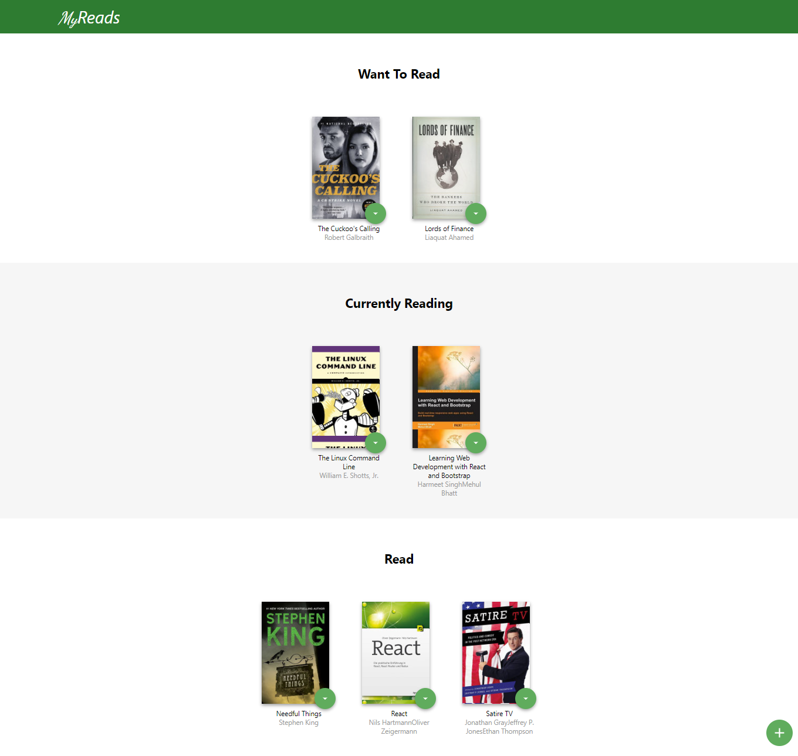
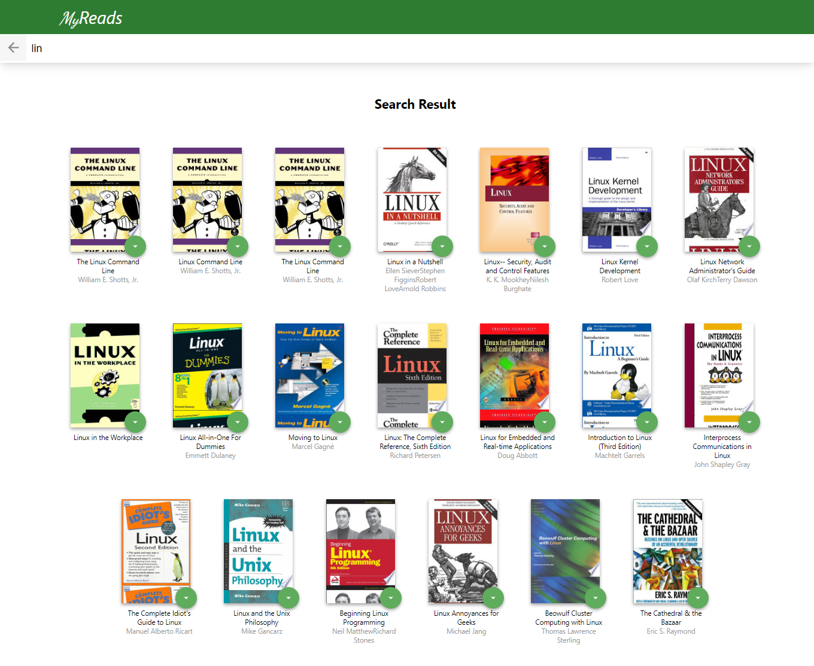

# Book Tracking App - Udacity 

## Table of contents

- [Overview](#overview)
  - [Features](#Features)
  - [Backend Server (API)](#Backend-Server-(API))
  - [Screenshot](#screenshot)
  - [Links](#links)
- [My process](#my-process)
  - [Built with](#built-with)
  - [Useful resources](#useful-resources)
- [Author](#author)

## Overview
MyReads: A Book Tracking App project | Simple React app
first project at Advanced Front-End Web Development Nanodegree Program

## Features

1. Easy to Install
2. the main page contains categories:
    - Currently reading
    - Want to read
    - Read
3. the search page have a search input that lets users search for books
4. user is allowed to move books between shelves 
5. information persist between page refreshes
6. responsive Design

## Backend Server (API)

To simplify your development process, we've provided a backend server for you to develop against. The provided file [`BooksAPI.js`](src/BooksAPI.js) contains the methods you will need to perform necessary operations on the backend:

* [`getAll`](#getall)
* [`update`](#update)
* [`search`](#search)

### Screenshot

### Links

- Solution URL: [Solution](https://github.com/joey493/Book-Tracking-App-Udacity)
- Live Site URL: [Live site](https://wizardly-albattani-fe24ca.netlify.app/)

### Built with

- HTML
-  CSS
  - Sass
- JavaScript
  -  React
    -  JSX
    -  Router
    - prop-types

### Useful resources

- [React documents](https://reactjs.org/)
- [Udacity](https://www.udacity.com/)

## Author

<!-- - Website - [Add your name here](https://www.your-site.com) -->
- Twitter - [@ibrahim33996](https://twitter.com/ibrahim33996)
